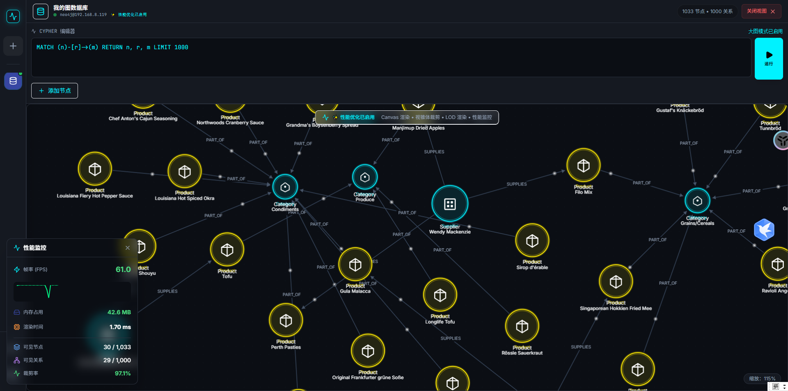
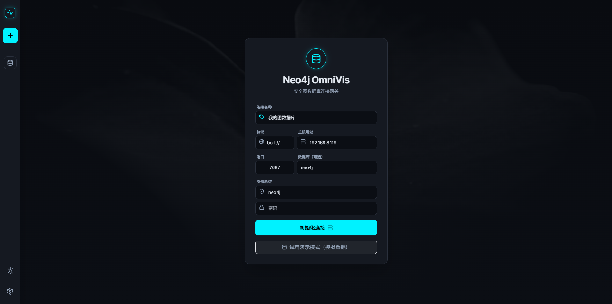
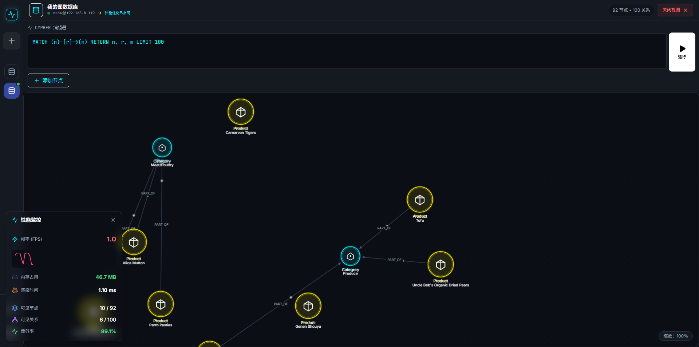
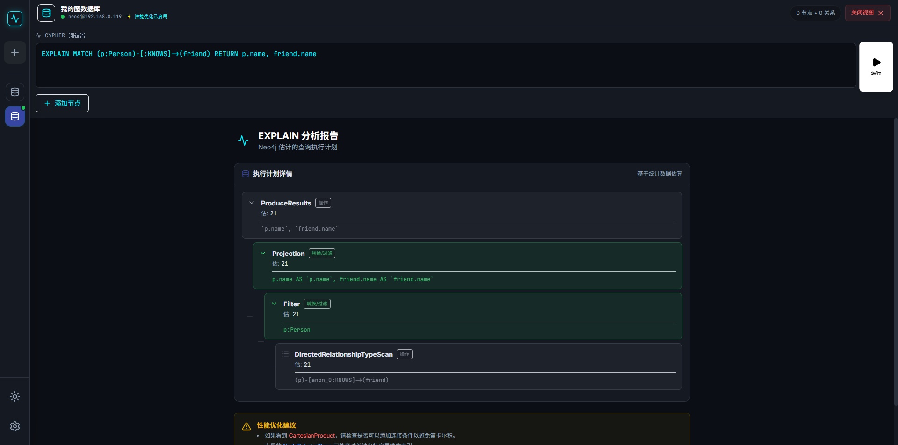
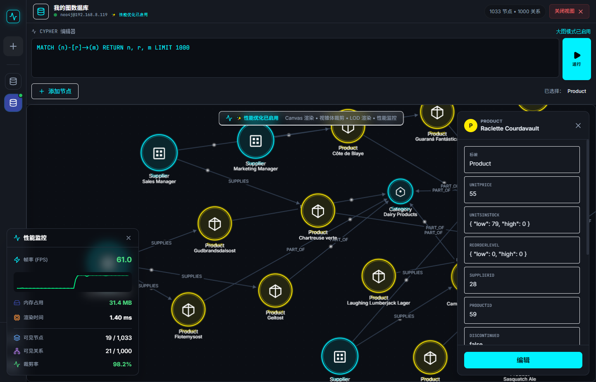
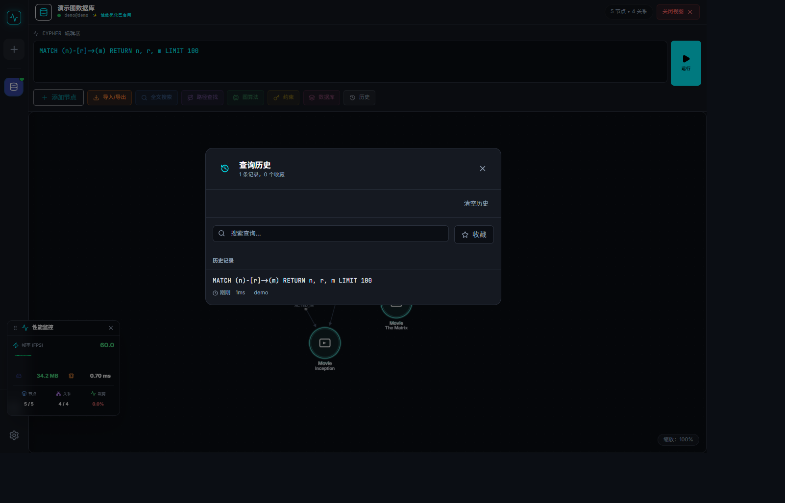
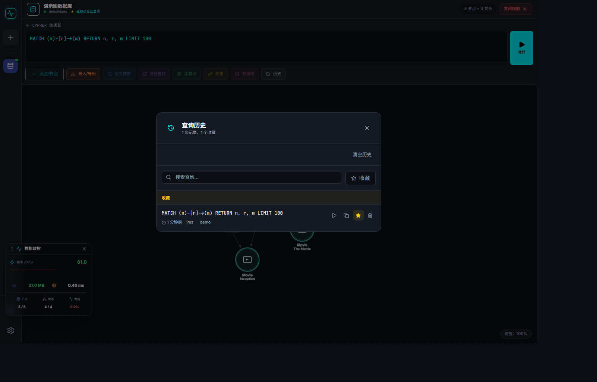

# GraphScope Neo

<p align="center">
  
  
  
  
  
</p>

<p align="center">
  <b>现代化的 Neo4j 图数据库可视化管理工具</b>
  <br />
  A Modern Neo4j Graph Database Visualization & Management Tool
</p>

<p align="center">
  
</p>

---

## ✨ 特性 Features

### 🔗 连接管理
- 支持多种连接协议 (bolt://, bolt+s://, neo4j://, neo4j+s://)
- 多数据库管理与切换
- 连接状态实时监控
- 演示模式（无需真实数据库）

### 📊 图可视化
- **D3.js 力导向图**：流畅的交互式图形渲染
- **视口裁剪优化**：仅渲染可见区域，支持大规模图数据
- **LOD 渲染**：基于缩放级别的细节层次渲染
- **实时性能监控**：FPS、内存占用、渲染时间追踪

### 🔍 Cypher 查询
- 完整的 Cypher 查询执行
- **语法自动补全**：关键字、函数、标签、属性智能提示
- **EXPLAIN/PROFILE 分析**：可视化执行计划
- **查询历史与收藏**：本地持久化存储

### 🛠️ 数据管理
- **节点 CRUD**：创建、读取、更新、删除节点
- **关系 CRUD**：完整的关系生命周期管理
- **批量操作**：事务性批量创建/删除/更新
- **约束管理**：唯一性约束、存在性约束、节点键约束

### 🔎 高级搜索
- **全文搜索**：支持模糊搜索、通配符、短语、布尔查询
- **路径查找**：最短路径、所有路径、K最短路径、加权路径
- **图算法 (GDS)**：PageRank、Louvain、中心性算法等

### 📦 数据导入导出
- 导出为 Cypher / JSON / CSV
- 从 JSON / CSV 导入数据
- 导出当前图视图

### 🎨 用户体验
- **暗色/亮色主题**：护眼暗色主题 + 亮色主题切换
- **响应式设计**：适配不同屏幕尺寸
- **键盘快捷键**：高效操作
- **赛博朋克风格 UI**：现代霓虹美学设计

---

## 🖼️ 截图 Screenshots

<table>
  <tr>
    <td></td>
    <td></td>
  </tr>
  <tr>
    <td align="center"><b>连接管理</b></td>
    <td align="center"><b>图可视化</b></td>
  </tr>
  <tr>
    <td></td>
    <td></td>
  </tr>
  <tr>
    <td align="center"><b>Cypher 查询</b></td>
    <td align="center"><b>Schema 浏览</b></td>
  </tr>
  <tr>
    <td></td>
    <td></td>
  </tr>
  <tr>
    <td align="center"><b>查询历史（记录）</b></td>
    <td align="center"><b>查询历史（收藏）</b></td>
  </tr>
</table>

---

## 🚀 快速开始 Quick Start

### 环境要求

- Node.js 18+
- npm 或 yarn 或 pnpm
- Neo4j 数据库 4.x / 5.x（可选，支持演示模式）

### 安装

```bash
# 克隆仓库
git clone https://github.com/YOUR_USERNAME/graphscope-neo.git
cd graphscope-neo

# 安装依赖
npm install

# 启动开发服务器
npm run dev
```

### 构建生产版本

```bash
npm run build
npm run preview
```

---

## 📁 项目结构 Project Structure

```
graphscope-neo/
├── components/                 # React 组件
│   ├── OptimizedWorkspace.tsx  # 主工作区
│   ├── OptimizedGraphCanvas.tsx # 优化图画布
│   ├── ConnectionManager.tsx   # 连接管理
│   ├── SchemaBrowser.tsx       # Schema 浏览器
│   ├── ExecutionPlanView.tsx   # 执行计划视图
│   ├── QueryResultTable.tsx    # 查询结果表格
│   ├── QueryHistory.tsx        # 查询历史
│   ├── ConstraintManager.tsx   # 约束管理
│   ├── FulltextSearch.tsx      # 全文搜索
│   ├── PathFinder.tsx          # 路径查找
│   ├── DatabaseManager.tsx     # 数据库管理
│   ├── AlgorithmRunner.tsx     # 图算法
│   ├── ImportExport.tsx        # 导入导出
│   └── PerformanceMonitor.tsx  # 性能监控
│
├── services/                   # 服务层
│   ├── neo4j.ts               # Neo4j 核心服务
│   ├── neo4j/                 # Neo4j 扩展服务
│   │   ├── transaction.ts     # 事务管理
│   │   ├── constraints.ts     # 约束管理
│   │   ├── fulltext.ts        # 全文搜索
│   │   ├── paths.ts           # 路径查询
│   │   ├── databases.ts       # 多数据库管理
│   │   ├── algorithms.ts      # 图算法 (GDS)
│   │   └── import-export.ts   # 数据导入导出
│   └── performance/           # 性能优化服务
│       ├── queryOptimizer.ts  # 查询优化器
│       ├── incrementalLoader.ts # 增量加载
│       └── loaderManager.ts   # 加载管理
│
├── core/                       # 核心架构
│   └── services/
│       └── ServiceRegistry.ts # 服务注册中心
│
├── utils/                      # 工具函数
│   ├── cypherAutocomplete.ts  # Cypher 自动补全
│   ├── dataValidation.ts      # 数据验证
│   └── performance/           # 性能工具
│       ├── lodRenderer.ts     # LOD 渲染器
│       └── viewportCulling.ts # 视口裁剪
│
├── types/                      # TypeScript 类型定义
├── e2e/                        # E2E 测试
└── docs/                       # 文档
```

---

## 🔧 技术栈 Tech Stack

| 类别 | 技术 | 版本 |
|------|------|------|
| 前端框架 | React | 19.2.4 |
| 类型系统 | TypeScript | 5.8.2 |
| 构建工具 | Vite | 6.2.0 |
| 图形渲染 | D3.js | 7.9.0 |
| Neo4j 驱动 | neo4j-driver | 5.20.0 |
| 图标库 | lucide-react | 0.563.0 |
| 样式 | Tailwind CSS | CDN |
| 单元测试 | Jest | 30.2.0 |
| E2E 测试 | Playwright | 1.58.0 |

---

## 📖 使用指南 Usage Guide

### 连接到 Neo4j 数据库

1. 启动应用后，在连接页面输入数据库信息：
   - **协议**：选择 bolt:// 或其他协议
   - **主机**：数据库地址（如 localhost）
   - **端口**：默认 7687
   - **用户名/密码**：数据库凭据

2. 点击"初始化连接"建立连接

3. 或点击"演示模式"体验功能（无需真实数据库）

### 执行 Cypher 查询

```cypher
// 查询所有节点和关系
MATCH (n)-[r]->(m) RETURN n, r, m LIMIT 100

// 查找特定标签的节点
MATCH (p:Person) RETURN p

// 路径查询
MATCH path = shortestPath((a:Person)-[*]-(b:Person))
WHERE a.name = 'Alice' AND b.name = 'Bob'
RETURN path
```

### 使用图算法 (需要 GDS 插件)

```cypher
// 运行 PageRank
CALL gds.pageRank.stream('myGraph')
YIELD nodeId, score
RETURN gds.util.asNode(nodeId).name AS name, score
ORDER BY score DESC
```

---

## 🧪 测试 Testing

```bash
# 运行单元测试
npm run test

# 监听模式
npm run test:watch

# 生成覆盖率报告
npm run test:coverage
```

---

## 🤝 贡献 Contributing

欢迎贡献代码！请遵循以下步骤：

1. Fork 本仓库
2. 创建特性分支 (`git checkout -b feature/amazing-feature`)
3. 提交更改 (`git commit -m 'Add some amazing feature'`)
4. 推送到分支 (`git push origin feature/amazing-feature`)
5. 创建 Pull Request

---

## 📄 许可证 License

本项目采用 [MIT License](LICENSE) 开源许可证。

---

## 📬 联系方式 Contact

如有问题或建议，欢迎通过以下方式联系：

| 平台 | 联系方式 |
|------|----------|
| 微信 (WeChat) | `li_freeLife` |
| QQ | `771603162` |
| 邮箱 (Email) | cwu981221@gmail.com |

---

## 🙏 致谢 Acknowledgments

- [Neo4j](https://neo4j.com/) - 强大的图数据库
- [D3.js](https://d3js.org/) - 数据可视化库
- [React](https://react.dev/) - 用户界面库
- [Vite](https://vitejs.dev/) - 下一代前端构建工具
- [Tailwind CSS](https://tailwindcss.com/) - 实用优先的 CSS 框架
- [Lucide](https://lucide.dev/) - 精美的图标库

---

<p align="center">
  Made with ❤️ by the GraphScope Neo Team
</p>
